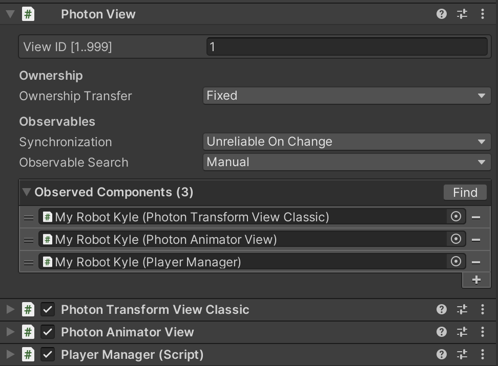

---
ebook:
  theme: one-dark.css
  title: Photon
  authors: Escatrgot
  disable-font-rescaling: true
  margin: [0.1, 0.1, 0.1, 0.1]
---
<style>
        h2:not(.tit) { border-top: 12px solid #143666; border-left: 5px solid #143666; border-right: 5px solid #143666; background-color: #143666; color: #FFF !important; font-weight: bold;}

    h3:not(.tit) { border-top: 3px solid #004480; border: 2px solid #004480; background-color: #004480; color: #FFF !important;}


    h4:not(.tit) { font-weight: bold; color: #FFF !important; }

    summary { cursor:pointer; font-weight:bold; color : #0F0 !important;}

    .red{color: #d93d3d;}
    .darkred{color: #470909;}
    .orange{color: #cf6d1d;}
    .yellow{color: #DD3;}
    .green{color: #25ba00;}
    .blue{color: #169ae0;}
    .pink{color: #d10fd1;}
    .dim{color : #666666;}
    .lime{color : #addb40;}
    
    .container {
        display : flex; 
        flex-direction:row;
        align-items:center;
    }
    .item {
        margin-right:2%;
    }

    @media screen and (min-width:1001px){
        .container {
            width: 90%;
            flex-wrap : nowrap;
            justify-content:center;
        }
    }
    
    @media screen and (max-width:1000px){
        .container {
            width: 98%;
            flex-wrap : nowrap;
            justify-content:center;
        }
    }
    
    @media screen and (max-width:799px){
        .container {
            justify-content:left;
            flex-wrap : wrap;
        }
    }

</style>


---

## 🔄 플레이어

### 📄 1. Player Animation을 통한 방향 조절
*  Apply Root Motion을 사용하고, 애니메이션에 Left, Right 음직임을 내포하면 
인게임에서 더 자연스러운 방향 전환이 가능해 진다.
   ```
   * Animator Component 의 훌륭한 기능들 중의 하나는 
   애니메이션에 기반하여 캐릭터를 실제로 움직 일 수 있다는 것입니다.
   * 이 기능을 Root Motion 이라고 부르며 
   Animator Component 에 디폴트 값이 true 인 Apply Root Motion 프로퍼티가 있습니다.
   * "_RunLeft_.Anim", "_RunRight_.Anim" 이 두가지 애니 메이션 에셋을 가지고 Blending 하는식으로 플레이어를 조작하면 
    스크립트가 아닌 애니메이션에 의존하는 음직임을 구현할 수 있다.
   ```
* 플레이어 인풋은 InputSystem으로 사용하면 더 빠른 반응을 얻을 수 있으니 이점을 공부해 보자.

### 📄 2). 네트워크 상의 Prefab 인스턴스화 하기
* 이 기능을 사용하기 위해서는 Resources 에셋 형태로 가져와야 하는 것 이고,
이 기능은 Addressalbe로 대체하는 것을 고민해야 한다.
    * [에셋번들 어드레서블(Addressable) 같이 사용하는법 1](https://wolstar.tistory.com/3)
    * [에셋번들 어드레서블(Addressable) 같이 사용하는법 2](https://doc.photonengine.com/ko-kr/pun/current/gameplay/instantiation)

### 📄 3). `MonoBehaviourPunCallbacks.photonView.IsMine`를 통한 소유권
* 그니깐 이게 true라는 것은 이 플레이어가 내꺼라는 것이고.
Instantiate 되었을때, 만약 다른 클라이언트에 의해 생성된 Instance라면 IsMine은 false가 되겠지
* 우리를 히트한 빔일때만 체력에 영향을 받기 원하므로 IsMine 체크를 한다.
  * 그럼 실제로 내가 쏜 빔이 플레이어 콜라이더에 붙으면 내가 진짜 데미지 입는것이다.
* 데미지 입는 주체는 다른사람이 아닌 내가 되야 하므로 IsMine true 라는 트릭을 이용해
굳이 Beam의 소유 객체를 체크하지 않아도 데미지를 입는 트릭이 가능하다.

---

## 🔄 플레이어 네트워킹

### 📄 1. PhotonView 컴포넌트

* 네트워크에 연결해주기 위해서는 PhotonView 컴포넌트가 무조건~ 액터에 붙어있어야 한다.
그래야 액터에 대한 데이터 공유가 가능하기 떄문이다.

<div align=center>
    
    <h5>이 사진이 나타내는 바는 <code>Observed Componenets</code>가 무엇이 추가 되었는지 면밀히 확인하자 </h5>
    <h5>1. PUN이 제공하는 View 컴포넌트를 붙인것을 연결한다든지.</h5>
    <h5>2. <code>IPunObservable</code>인터페이스를 구현한 컴포넌트인지.</h5>
</div>

---

### 📄 2. 네트워크 플레이어 인스턴스 생성


#### 1). `PhotonNetwork.Instantiate(prefabName, ...이하 동문...)`

* 설명
  : 프리펩의 string 이름으로 인스턴시에이트 하는데 중요한 점은
  내부 구현은 `Resources.Load()` 로 구현되어 있다는 것을 이해해야 한다.

### 📄 3. 씬 전환에도 유지되는 플레이어

* 새로운 플레이어가 들어왔다던지, 다름 레벨로 이동했다던지 등등 
이때, 디폴트 씬을 만들 때는 당연히 내 플레이어가 존재하지 않는 씬일 것이다.
* 이떄 동적으로 씬 전환시 내 플레이어를 유지하게 하려면 `DonDestroyOnLoad(this.gameObject)`와 `Static Instance's Ref`를 통해 내 클라이언트의 플레이어를 캐싱해야한다.
  * 씬 이동할때 마다에 상관없이 오브젝트 생성에 딱 한번 실행되는 `Awake()`를 응용하여 
  내 클라이언트의 플레이어를 위와 같은 돈디스트로이드와, 스태틱 캐싱을 하자.
  * 그리고 씬 이동마다 수행해야하는 함수를 `UnityEngine.SceneManagement.SceneManager.sceneLoaded` 에 구독하게끔 하고 
  당연히 충첩 되지 않도록 이 함수가 실행되고 나면 
  구독 해제 문법도 이동시 수행할 함수 동작에 함께 추가하자

### 📄 4. Dependency Setter Binding

* A --> B 관계 (즉, A 오브젝트가 B 오브젝트에 의존할 때,) 
그리고, A는 B의 생명주기를 가지고 있다면. **"생성자 Setter 의존 주입"** 을 응용해보자.
  ```cs
  public class A {
    B dependingObject;
    A() {
        dependingObject = new B(this);
    }
  }

  public class B {
    B(A owner) {
        Get Owner's Someting;
    }
  }
  ```

### 📄 5. WorldPosition to ScreenPosition

* 게임 오브젝트가 즐비하는 world의 3d 요소를 
어떻게 ui가 즐비하는 screen의 2d요소로 위치를 맞출 수 있을까?
    ```cs
    /* UI Script */
    this.transform.position = Camera.main.WorldToScreenPoint (targetPosition) + screenOffset;
    ```
* 2d 위치와 3d 위치를 맞추기 위한 트릭으로 카메라의 WorldToScreenPoint 함수를 이용합니다. 
그리고 게임에서 카메라 하나만을 가지고 있으므로 
유니티 신의 디폴트 설정에 있는 메인 카메라를 사용할 수 있습니다.

---

## 🔄 고민할 거리

#### 1. Resources 대신 Addressable을 사용해 보자.
