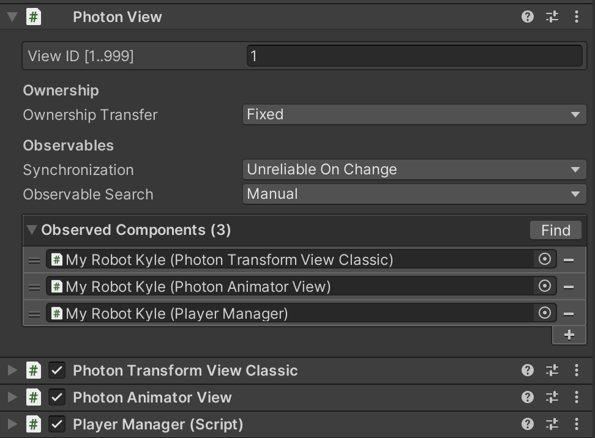

---
ebook:
  theme: one-dark.css
  title: Photon
  authors: Escatrgot
  disable-font-rescaling: true
  margin: [0.1, 0.1, 0.1, 0.1]
---

## 🔄 플레이어 네트워킹 

PhotonView 컴포넌트

* 네트워크에 연결해주기 위해서는 PhotonView 컴포넌트가 무조건~ 액터에 붙어있어야 한다.
그래야 액터에 대한 데이터 공유가 가능하기 떄문이다.

    
    <h5>이 사진이 나타내는 바는 <code>Observed Componenets</code>가 무엇이 추가 되었는지 면밀히 확인하자 </h5>
    <h5>1. PUN이 제공하는 View 컴포넌트를 붙인것을 연결한다든지.</h5>
    <h5>2. <code>IPunObservable</code>인터페이스를 구현한 컴포넌트인지.</h5>

### 📄 1. Trasnform 동기화
### 📄 2. Animator 동기화
### 📄 3. 사용자 입력 관리
### 📄 4. 카메라 제어
### 📄 5. 광선 발사 제어
### 📄 6. 체력 동기화