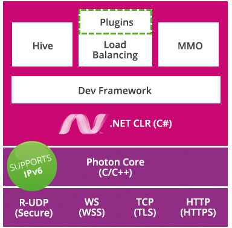

> ### 📄  PUN2

#### 1). Actor (액터)

* 룸안에 있는 플레이어
* 룸안에는 `ActorID`로 접근

#### 2). Binaries Folder (이진 폴더)

* `Photon Server SDK` 에서 바이너리 폴더에는 플랫폼별로 Photon Core 의 빌드들이 포함
* `Photon Server SDK` 에서 `deploy` 폴더는 Photon 실행을 위한 모든 것이 있습니다.
    ```bash 
    # 디렉토리 경로
    */deploy
    ```

#### 3). RUDP ( Reliable UDP )
* UDP의 확장 프로토콜 : 전송자는 수신확인 받기 전까지 반복적으로 메시지를 전송.
* **ACK** : 명령이 잘 전달되었는지 확인할 수 있다
* **Channel** : 포톤 Chat의 대화 채널이란 의미도 있지만, 여기서는 RUDP 프로토콜의 로우레벨 채널을 지칭한다.

#### 4). Concurrent User (CCU) - 동시접속 사용자
#### 5). Dashboard (대시보드)

* 대시보드는 모니터링의 목적으로 카운터 데이터를 모으고 그래프를 생성.

#### 6). Event (이벤트)

* 이벤트는 클라이언트에게 전송하는 동기적 메시지. 
* 이벤트의 발생 주체는 ActorNumber 로 구분.
* EvCode : 이벤트 코드의 줄임말, 이벤트의 유형과 이벤트와 같이 오는 정보의 식별을 위해서 사용.

#### 7). 오퍼레이션 (클라가 서버에 보내는 RPC)

* "Photon 서버 측의 RPC 함수"의 다른 명칭.
* 클라이언트는 서버 측에 무엇인가를 수행하거나 다른 쪽에 메시지 전송을 위해사용
* OpCode를 통해 서버측의 오퍼레이션을 트리거하기 위해 바이트값을 사용한다.

#### 8). Messages (메시지)

* 클라, 서버에서 "오퍼레이션, 응답, 이벤트 등등." 무엇을 업데이트 하는 모든것임.
* 종류
  1. RPC
  2. 동기화 갱신
  3. 인스턴스 생성 호출
  4. 커스텀 속성 변경 ( 플레이어 이름 등.. )

* Message Limit : 룸당 메시지와 초당 메시지를 제한

#### 9). Peer

* 포톤에 접속하고 있는 모든 클라이언트

#### 10). PhotonServer.config
* Photon Core 의 설정 파일 입니다. IP, 어플리케이션과 성능 에 대해서 설정.

#### 11 ). Photon Core (Photon 코어) / Socket Server (소켓서버)

* Photon 의 C++ Core, Socket Server는 Core 다른 이름.
* 연결과 eNet 프로토콜을 관리.

#### 12). 룸

<div align=center>
    
    <h5>포톤의 룸 컨셉</h5>
</div>

* 클라이언트는 오직 하나의 룸에만 참가할 수 있음
  1. 룸을 생성하고 이름으로 룸에 참여
  2. 룸과 플레이어에 대해 커스텀 프로퍼티를 설정
  3. 로비에서 표시/비표시 설정
  4. 오픈 또는 클로즈(아무도 들어갈 수 없음)


#### 13). Turnbased (턴기반)

* Turnbased는 Photon Cloud 플랜의 하나로, 
* 비동기적인 게임 플레이를 위해 설계한 기능을 집약 해 놓은 것. 
* 플레이어가 방에서 비활성화 된 이후 나중에 게임을 계속할 수 있음. 
* 룸 상태 (이름, 속성 캐시 된 이벤트 등)가 자동으로 보관됨.

> ### 📄  Server

<div align=center>
    
    <h5>Photon Archtecture</h5>
</div>

#### 1). Photon Server 어플리케이션

* 멀티플레이어 게임 백엔드를 구축하는데 사용하는 C# 코드
* 서버 애플리케이션 솔루션들
  1. LoadBalancing (Photon Cloud) : 서버간 로드밸런스 해 주는 스케일링
     PUN, LoadBalancing API를 쓰는 클라이언트들이 사용하는 서버
     Chat, Voice, PUN, BOLT 등등..
  2. MMO : 수많은 플레이어들이 참여하는데 사용
  3. Lite : 가장 기본적인 Photon 개념
  4. Photon Core :  IOCP(IO Completions Prot) 사용
* 지원 프로토콜
  1. UDP(RUDP)
  2. TCP
  3. HTTP
  4. 웹소켓
* 개발 프레임워크
  * 파이버 단위 비동기 
  * RPC 호출

#### 2). Master Server

* GameServer을 선택하는 서버
* 마스터 서버에 존재하는 클라이언트를 게임서버로 분산하여 보낸다.

#### 3). Game Server

* 마스터 서버에서 선택된 서버로 클라이언트가 접속할 2차 서버다.

#### 4). 데이터 보관소 DBs

PhotonServer가 의존하는 DB
1. RDBS : MySQL, PostgreSQL
2. NoSQL : MongoDB, Redis