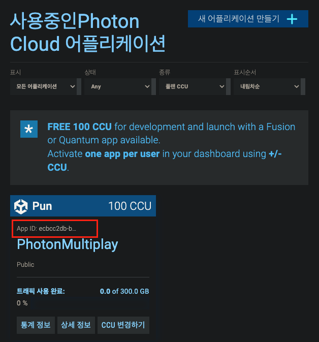

## 🔄 Photon 소개

> #### PUN2 (Photon Unity Networking) 패키지를 사용해 보자 

##### ① 제공하는 기능들

1. 클라-서버 연결&콜백
2. 객체/데이터 직렬화 & 동기화
3. 매치 메이킹
4. API (클라쪽에서 서버에 요청할 수 있는 인터페이스) 제공
   * LoadBalancing API & RPC API
5. Shared Room 방식의 토폴로지만 제공

##### ② PUN2 만으론 부족한 것들

1. 서버 구축 
   1. Cloud Server (LoadBalancing, MMO, Lite, Photon Core C++) 

##### ③ 그니깐.. 멀티게임을 만든다는 것은..
1. 클라이언트는 PUN2 가 제공하는 기능을 구현하고 사용해야 하고
   * "Unity NetCode", "Mirror", "Photon Fusion,Fun,Quantum"
2. 서버 호스팅으로 Cloud, OnPremise든 외부에 자원을 두고 이용할 수 있어야 한다.

---
> ### 📄   1. 연결과 콜백

#### 1). 연결 

##### `PhotonNetwork.ConnectUsingSettings()`

* 즉시 온라인 상태로 만들어 줌
    ```
    온라인이 되면 발생하는 일 콜백, 변수 최소 조건이 뭐지? 변경되는 것들은?
    ```
* "PhotonServerSettings.Asset" 에셋에 의존

#### 2). 콜백

##### ① 클래스가 네트워크 콜백에 작동되는 방법 두가지
1. **인터페이스 구현 & 구독**
    * a : 어떤 클래스가 네트워크에 의한 모든 상태 변화에 대해 감지하도록 하고 싶다면
    PhotonNetwork에 구독될 수 있는 target 형태가 되야 한다.
      ```cs
      // 예를들어 유니티에서, MonoBehaviour의 OnEnable() 과 OnDisable()을 사용하실 수 있습니다.
      PhotonNetwork.AddCallbackTarget(this);
      PhotonNetwork.RemoveCallbackTarget(this);
      ```
    * b : 클래스가 `PhotonNetwork.XXXCallbackTarget(this)`에 구독 가능한 
    target 형태가 되려면, Pun 콜백 인터페이스를 Implement해야 한다.

2. **`MonoBehaviourPunCallbacks` 클래스 상속받기**
    * 이걸 상속받으면 위 콜백 등록을 호출할 필요는 없음 

##### ② 네트워크 콜백의 종류 / 인터페이스들
* `IConnectionCallbacks`: 연결 관련 콜백.
* `ILobbyCallbacks`: 로비 관련 콜백.
* `IMatchmakingCallbacks`: 매치메이킹 관련 콜백.
* `IInRoomCallbacks`: 룸안에서 발생한 것에 대한 콜백.
* `IPunOwnershipCallbacks`: PUN 소유권 이전 콜백.
* `IOnEventCallback`: 수신된 이벤트에 대한 단일 콜백. C# 이벤트 LoadBalancingClient.OnEventReceived 와 '동등' 합니다.
* `IWebRpcCallback`: WebRPC 오퍼레이션 응답 수신에 대한 단일 콜백.
* `IPunInstantiateMagicCallback`: PUN 프리팹의 인스턴스화에 대한 단일 콜백.
* `IPunObservable`: PhotonView 직렬화 콜백.

---
> ### 📄   2. 매치 메이킹

##### 제공 하는 기능

1. `IMatchmakingCallbacks`의 기능들 ( 룸 생성 / 룸 참여 / 룸 게임 시작 )
2. 서버는 클라이언트에서 요청한 무작위 룸을 선택해야 한다.
3. 다양한 필터링 옵션으로 선택범위를 좁힐 수 있다.
4. 매치메이킹이 가능한 상태는 클라이언트가 PhotonServer's Master Server에 접속했을 때, 가능하다. 

#### 1). 로비와 룸 목록
* 서버에 쿼리문을 날릴 수도, 클라이언트 사이드에서 `SQL Lobbay` 사용 가능
* 이를 통해 룸에 대한 필터링가능

#### 2). 룸 옵션

* 룸 생성시 옵션 세팅 가능
  1. 최대 플레이어 수
  2. Private 룸 생성
* userID 접근을 통해 연결 끊김 등등을 처리 가능

#### 3). 매치메이킹을 위한 사용자정의 속성

#### 4). 슬롯 예약
* 가까운 사람과 팀, 단체 매칭을 위해 슬롯 예약이라는 기능으로 플레이어를 고정하여 같이할 수 있다.


---
> ### 📄   3. 게임 로직


#### 1). 네트워크 객체 : `PhotonView Componenet`

<div align=center>
    
</div>

##### ① 네트워크 게임 오브젝트
* `PhotonView Componenet` 컴포넌트가 Add 된 게임 오브젝트는
* `PhotonView.ViewID`를 통해 네트워크 객체를 식별한다.
* "networked GameObjects" 로써 `PhotonNetwork.Instantiate`를 통해 동적 생성할 수 있다. 
* 또한 객체-제어 이전 : 게임 오브젝트의 제어권을 요청하거나 양도할 수 있음.


##### ② `PunObservable Interface`
* `PhotonView Componenet` 컴포넌트가 Add 된 게임 오브젝트,
즉, 네트워크 게임 오브젝트 라면 가지는 중요한 특징은 바로 **상태 동기화** 이다.
* 초당 몇회의 네트워크 상태의 Read/Write 책임을 갖고 있음 
  * *대표적으로 게임 오브젝트의 `Trasnform`, `RigidBody` 를 주고 받고 할수있다.*
  * *Mecanim (Animator) 동기화 : 애니메이션 상태를 자동으로 동기화 하기도 한다.*
* 그리고 동기화가 된다 라는 의미는 **Serializable 즉, 객체 멤버에 대해 직렬화가 가능해야 한다.** 
  * 다음 인터페이스 함수를 Implement 해야한다.
  `IPunObservable.OnPhotonSerializeView(PhotonStream, PhotonMessageInfo)`


#### 2). 메세징

##### ① RPC : "원격 프로지셔 호출"
*  특정 네트워크 객체상에 때로 발생하는 모든것에 대해 원격 프로시저 호출 사용 가능
  * `photonView.RPC("OnAwakeRPC", RpcTarget.All, (byte)1);`
  * `[PunRPC] : Attribute \ void OnAwakeRPC(byte myParameter)`

##### ② 직렬화 데이터 메시징
* `IPunObservable.OnPhotonSerializeView(PhotonStream, PhotonMessageInfo)` 함수를 구현해야 함.

##### ③ Non-GameObject Class 메시징
* GameObject와 별개로 이벤트 전송도 가능하다.
* `PhotonNetwork.RaiseEvent(eventCode, eventContent, raiseEventOptions, SendOptions.SendReliable);`

##### ④ **메세지를 서버에 버퍼링 할 수도 있다.** 
* 나중에 참가한 플레이어에게 메세지 전송
* 캐릭터 스폰


#### 3). 동기화된 타임스탬프
* 클라이언트가 Photon Server에 연결할 때마다 지연된 타임스탬프가 동기화할 것 입니다.
* 모든 플레이어가 동일 게임 서버에 연결되므로, 이벤트 타이밍을 동기화 할 때 사용할 수 있다.

#### 4). 비교하고 스왑(Compare-And-Swap, CAS)
* 클라 변조를 막을떄 사용할 수 있을 것 같아 보인다.

#### 5). WebHooks 그리고 데이터 보관 전략
* Photon Server와 다른 서비스 및 사용자 서비스를 연결하기 위해서 WebHooks의 개념을 이용합니다.
* 외부 REST 기반 서비스를 업데이트하는 데 사용할 수 있습니다.

#### 6). 턴기반 게임

* 턴 기반 게임에 두가지 옵션 제공
  1. PlayerTTL은 연결이 끊긴후 참가자가 룸에서 "비활성" 상태를 유지하는 시간을 정의
     *"비활성" 상태? 이때 게임에서 어떻게 표시되는지 예시는 없나* 
  2. PlayerTTL은 룸의 모든 플레이어들의 연결이 끊긴 이후 룸이 존재하는 시간 정의
     재참여하는 플레이어들을 위해 룸과 플레이어 스팟을 유지할 수 있음

---

## 🔄 Photon 설정과 연결

<div align=center>
    
    <h5>  "Window", "Photon Unity Networking" 메뉴 </h5>
</div>

##### ① Application ID (AppId)

<div align=center>
    
    <h5> 관리화면 </h5>
</div>

* Photon Cloud 에서 어플리케이션ID(AppId)는 타이틀과 가상 어플리케이션의 주 식별자 입니다.
AppId는 대시보드에서 쉽게 찾을 수 있습니다. 거의 모든 데모에서 AppId 가 필요하게 됩니다.

#### PhotonServerSettings

<div align=center>
    
    <h5>인스펙트내의 PhotonServerSettings</h5>
</div>

1. **AppId Realtime, Chat 그리고 Voice** 
2. **App 버젼**: 다른 버젼 클라끼리 서로 분리
3. **네임 서버**: **자체 호스팅할 경우에는 체크 해제하자**
4. **고정된 지역**: 기본값은 최적의 지역을 선택
5. **서버**: 포톤 서버를 호스팅할때 사용 이렇게 하기 위해서는, Photon Server SDK가 필요함
6. **포트와 프로토콜**: 하나의 세션에서 여러개의 서버들을 사용하기 위해 구축
iOS용 게임을 개발한다면 "PUN 과 IPv6" 그리고 "IPv6 에서 Photon Server 설정 방법" 을 읽어 보시는 것도 좋습니다.
여기에 입력된 포트 번호는, 연결할 첫번째 서버중 하나임
그리고 일반적으로 전송 프로토콜은 UDP 이지만, TCP, WebSockets을 지원하기도 함
7. **로깅**
    * **로비 통계 사용** : 서버에서 로비 통계를 받기 위해서는 이것을 반드시 체크해야 합니다.
    * **네트워크 로깅**
    * **Support Logger** : 연결, 매치메이킹 또는 룸에서 발생하는 작업을 추적해야 할 때 유용합니다. 
    이 옵션을 선택하면 스크립트가 콜백에 등록되고 게임 디버깅에 도움이 되는 중요 정보를 기록합니다.
8. **RPC 목록**
    * 룸 내의 다른 클라이언트 상의 메소드를 호출 할 수 있도록 해줍니다.
    * PUN은 이러한 방법의 목록을 "PhotonServerSettings.Asset" 에 보관하며 
    RPC를 호출할 때 각 이름의 인덱스를 약어로 사용합니다.
