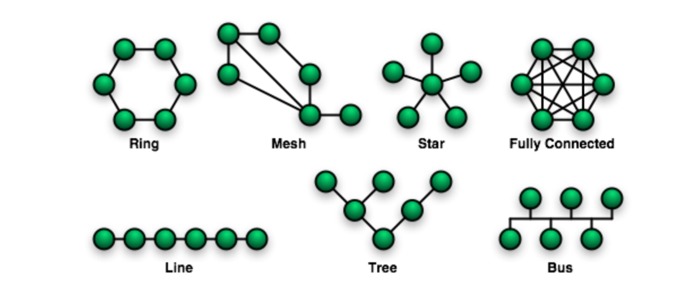

---


## 🌐 토폴로지 구성 요소

#### 종단기기 
* 일명 네트워크의 가장 말단 기기를 지칭한다.
  * 다른 말로 역시 Endpoint, Peer, Node로 대체하여 부를 수 있다. 

##### ① 클라이언트 (플레이어)

* 서버에 접속하는 종단기기 하나는 사용자 (플레이어) 한 명을 대표합니다.

##### ② 서버(서버, 호스트)

* 온라인 상의 모든 클라이언트 기기의 자료와 명령을 처리하는 서비스를 제공하는 종단기기
  동시에  모든 온라인 통신을 유지하고, 정적데이터(DB), 비즈니스 로직을 엑세스한다.

* 서버 서비스 구축
  1. Cloud (Amazon EC2, Azure, Google Cloud) : 가상 컴퓨팅으로 서버 제작
  2. OnPremise : 직접 남는 컴퓨팅 머신으로 서버를 만들 수 있다.

##### ③ 마스터 클라이언트

* 특수한 클라이언트 이며 일부 서버의 기능을 제공하기도 한다.
  * 다른말로 호스트 라고 불리기도 한다.

---

## 🌐 네트워크 토폴로지

<div align=center>
  
</div>

> ### 📄 1. Client-Server : 

#### 1). Dedicated 

* 네트워크 멀티 플레이 게임에서 **중앙 처리 서버**
  * 지속적이고 안전한 대규모 서비스 가능 관리가 필요하다.  
  * 별도의 전용 컴퓨터가 필요함, 그래픽 렌더링을 하지 않음. 
  * 보안 공정성 안정성이 높아야 함.

* **Auth** : 서비스 제공자에게 권한이 있어 변조에 안전하다.
* **Cost** : 서비스 제공자의 운용 비용이 비싸다.
* **Latency** : 높은 CPU 퍼포먼스를 유지할 수 있다 *GPU는 어차피 클라이언트 역할이니.*

#### 2). Host Listen
* 데디케이트 서버랑 비슷한 동작인데 다만, 세션을 호스팅을 하는 중앙 처리 **서버가 클라이언트중 하나가 서버가 된다**
  * 호스트 본인도 게임에 참여하는 방식
  * 그렇기 떄문에 그래픽 렌더링과 통신처리도 동시에 하기 떄문에 부하가 좀 심하다.
* 방법 : 클라우드 서비스에, 서버 프로세스를 올려놓고, 게임을 실행하도록 설계한다.

* **Auth** : 단, 호스트 서버가 해킹이나 변조를 시킬 수 있음.
* **Cost** : 서비스 제공자의 운용 비용이 저렴하지만
* **Latency** : 따라서 호스트 서버의 컴퓨팅 능력에 따라 퍼포먼스가 결정되고

> ### 📄 3. P2P

* **중앙 처리 서버 없이, 각 클라이언트가 서로서로의 공유 자원을 주고 받는** 방식이다.
  * 피어 (클라이언트/플레이어)별 자료 전송시, 다른 피어에게도 동시 전송되고
  * 모든 사용자가 전송한 자료를 수신하게 됨.

* **Auth** : 서로 서로 감시가 있으니 비교적 안전하다 할 수 있다.
* **Cost** : 가장 싸다 직접적으로 자료 교환이나 처리를 담당하는 센터 서버가 없기 때문에.
* **Latency** : 비교적 느릴수 있음


---

## 🌐 유니티에서 사용 가능한 패키지

#### 1). Mirror

* UNet 이 deprecated 되면서 이를 포크해서 만들어낸 오픈소스 패키지
  * 클라이언트 기반 멀티 플레이 환경을 기대하여 만든 패키지
    ```
    P2P, Host (Listen) 서버 형식
    동기화 대상 객체를 바인딩해서 RPC, SyncVar 기법으로 동기화한다(?)
    플랫폼별 RUDP 스펙의 프로토콜 지원함
    서버 어플리케이션으로 데디케이팅 하는게 불가능하진 않음
    ```
  * 튜토리얼을 몇개 돌려보니 포톤에 비해 배포, 자동화가 까다로울 것 같다.

#### 2). Photon 

* PUN : 직렬화 모델의 생성 (ProtoBuf 같은건가?) 과 RPC 호출을 중심으로 배포가능한 서버 어플리케이션으로 멀티플레이를 연결
  * Dedicated 서버
* BOLT : 동기화 기법자체는 PUN 과 다르지 않음. 
    ```
    세션간 High performance 를 목표로 한다고 소개하고 있다.
    P2P, Host 서버 형식
    무료로 제공되는 패키지
    ```
* FUSION : PUN계열 계승한거라 함
  ```
  Dedicated
  Host Listen
  Shadred
  ```

[PUN vs BOLT](https://doc.photonengine.com/ko-kr/pun/current/reference/pun-vs-bolt)

#### 3). Unity RPC

* 가볍고, 동기화 목적의 성향을 가지는 통신에 대해서 유니티에서 제공하는 RPC 패키지를 사용하자.

---

## 참고

#### [멀티플레이어 게임 패턴 - 2](https://support.photonengine.jp/hc/ko/articles/115003934287-%EB%A9%80%ED%8B%B0%ED%94%8C%EB%A0%88%EC%9D%B4%EC%96%B4-%EA%B2%8C%EC%9E%84-%ED%8C%A8%ED%84%B4-Part-2)