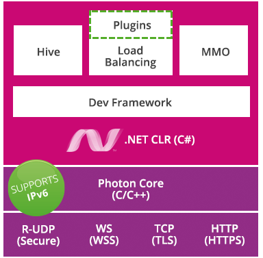

## 참고
---

## 🔄 Photon Server


<div align=center>
    
    
    <h5>Photon Archtecture / Photon Cloud 연결 예시</h5>
</div>

#### 1). Photon Server

* 실시간 소켓 서버이고 시렞로 Photon Core가 C++로 구현된 환경도 IOCP를 사용한다.
* Photon Server SDK 멀티플레이어 게임 백엔드를 구축하는데 사용하는 C# 코드를 제공한다.

##### ① Photon Server Archtecture
* 서버 애플리케이션 솔루션들
  1. LoadBalancing (Photon Cloud) : 서버간 로드밸런스 해 주는 스케일링
     PUN, LoadBalancing API를 쓰는 클라이언트들이 사용하는 서버
     Chat, Voice, PUN, BOLT 등등..
  2. MMO : 수많은 플레이어들이 참여하는데 사용
  3. Lite : 가장 기본적인 Photon 개념
  4. Photon Core :  IOCP(IO Completions Prot) 사용

##### ② 지원 프로토콜
  1. 전송 프로토콜 : UDP(RUDP)/ TCP/ WebSocket
  2. 응용 프로토콜 : HTTP

##### ③ 서버 개발 프레임워크 (C#)
  * RPC 호출
  * 파이버 단위 비동기 메시징

##### ④ 데이터 보관소 DB
* PhotonServer는 저장 레이어를 제공하지 않고 타 제품에 의존하게 된다.
  1. RDBS : MySQL, PostgreSQL
  2. NoSQL : MongoDB, Redis

#### 2). 네트워크 서버 & 로비 & 맵 구성

<div align=center>
    
    
    <h5>Photon Cloud 연결 예시</h5>
</div>

#### 1). 서버의 분류

##### ① Master Server

* 서버를 관리하는 서버 특징은 세계 각지 여러  지리적 위치별로 다른 마스터 서버가 분포 되어 있다.
  1. 서버 관리 : 각 서버의 상태를 기록하고 감독, 주요 데이터를 점검하고 업데이트 함
      ```
      클라이언트는 게임 서버에 연결되기 전. 
      1. 마스터 서버와 연결이 되야 하며, 
      2. 게임서버 연결 데이터를 취득하고,
      3. 실제 게임 서버 플랫폼과 연결해야함.
      ```
  2. 로드 밸런싱 : 마스터 서버에 존재하는 서로다른 클라이언트를 서로 다른 게임서버로 분배해 로드 밸런싱을 조정

##### ② Name Server

* 네임 서버 또한 관리 서버

##### ③ 부하 분산 서버(서비스)

* 대량의 사용자를 적합한 서버 플랫폼에 분산 시키는 서버.
* 동적으로 대랑의 사용자를 하나 혹은 여러 마스터 서버, 게임 서버 등으로 분산함

##### ④ Game Server

* 마스터 서버에서 선택된 서버로 클라이언트가 접속할 2차 서버다.
* 신규 사용자뿐만 아니라 게임을 플레이하고 있는 사용자도 게임 서버와의 연결을 기다립니다.

#### 2). 로비 & 룸

##### ① Game Lobby 

* 룸을 찾을 수 있는 검색 기능과 진입해 플레이 할 수 있는 기능을 제공
* 추가로 로비에서 채팅 또한 제공 되는 사례도 있겠다.

##### ② Game Room 

* *라운드/세트/맵/구역/레벨* 등등의 다양한 용어로 불리며, 모든 사용자의 데이터 전송 및 운영을 전담 처리함
* 이 단계 에서는 클라이언트(플레이어)가 같은 룸에 있기만 하면 
동일한 게임 월드 공간에서 상호 교류할 수 있다. 
  * 다른 룸끼리는 상호 작용 불가능하다.
    채팅같은 사례는, 채팅 서버가 존재하므로 전역적으로 받을 수 있다.
  * 하나의 룸에 들어간 클라이언트(플레이어는) 사용자를 식별할 수 있는 이름 ID가 존재한다.

* MMO 맵 같은 광범위한 맵은 구역별로 룸을 나누어 
룸 로딩을 하거나, 오픈 월드 같은 경우 프록시 맵 개념을 사용할 수 있겠다.

> ### 📄   1. 호스팅 - SaaS PhotonCloud (LoadBalancing, MMO, Lite)

#### 1). PUN 클라이언트는 클라우드에 연결해야한다.

#### 2). 최적지역
* 동일한 네트워크에 연결된 클라이언트라 하더라도, 서로 다른 지역으로 연결 되기도 한다.
* 온라인 지역 화이트 리스트를 사용하여 지역을 지정해 접속할 수 있다.
#### 3). Udp, Tcp 와 WebSockets
* 기본 전송 프로토콜은 UDP 임
* WebSocket 같은 경우 일부 플랫폼에서 유일하게 지원되는 프로토콜이다.

---
> ### 📄   2. 일반 사항

#### 1). `PhotonView` 컴포넌트를 통해 게임 객체를 쉽게 네트워크로 연결할 수 있음
#### 2). 인증
* Photon은 게임 타이틀에서 사용해야 하는 커뮤니티 백엔드를 통합하기 위해 아주 간단한 REST API를 사용

---
> ### 📄   3. 성능 옵션
#### 1). Pooling 지원
* 모든 네트워크 개체에 대해 풀 구현을 사용할 수 있음.

#### 2). 캐싱

* 인스턴스화 하기 위해 로드되는 리소스를 캐시할 수 있음
* 가비지 콜렉션을 감소시켜 메모리 비용을 줄여줌

#### 3). SendRate/SendRateOnSerialize

* PUN은 네트워크 개체에서 업데이트 쓰기(그리고 읽기) 속도를 제어할 수 있음.
* 메시지를 넣어 어떤 업데이트에 보낼지에 대한 속도는, 독립적으로 설정가능

---
> ### 📄   4. 자체 호스팅 - 온프레미스
#### 1). PhotonServerSettings
* **네임서버 체크 해제 & 고정 지역 지우기**
* "Server" 세팅에 기입할 값을
  * IP (스탠드얼론 빌드이면 "localhost" 또는 127.0.0.1)
  * 포톤 서버의 호스트 명

#### 2). 수동 연결
* 두가지가 필요하다.
    1. **masterServerAddress** : On-Premises DNS명 또는 IP, 
    2. **port** 

---
